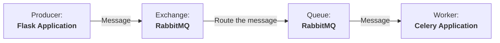

# E-mail Sender REST API
### Technologies
<section align="left">
    
    
    
    
     
    
    
    
    
    
    
    
    
    
    
</section>

### Technologies
- __List all emails:__ Retrieve all sent or scheduled emails, with the option to filter by status (e.g., sent, pending, failed).
- __Get specific email details:__ Fetch detailed information of a specific email using its unique identifier (UUID).
- __Immediate email sending:__ Enable sending an email instantly through the dedicated endpoint.
- __Schedule email sending:__ Support scheduling emails to be sent at future times, facilitating campaigns or timed notifications.
- __Cancel scheduled emails:__ Allow cancellation of previously scheduled emails by referencing the schedule’s UUID.

#### Installation Guide
##### 1. Clone this repository
```bash
git clone https://github.com/TechAbraao/email-sender-rest-api.git
```

##### 2. Check out the manual installation:
  1. Create and activate the virtual environment
```bash
python3 -m venv .venv

# Activate the virtual environment (Linux or Mac)
source .venv/bin/activate

# Or, if you're on Windows
# .venv\Scripts\activate
```
  2. Install dependencies
```bash
pip install -r src/requirements.txt
```

##### 3. Or configure with Makefile:
  1. At the root of the project, run:
```bash
# Creates virtual environment (.venv) and Installs dependencies from src/requirements.txt
make start-setup 
```

##### 4. Configure ```.env.example``` and rename it to ```.env```
Configure these main variables:
```bash
# E-mail Configuration
SMTP_SERVER=    # Example: smtp.gmail.com
SMTP_PORT=
SMTP_EMAIL=
SMTP_PASSWORD=

# Database PostgreSQL and PGAdmin4 Configurations
## PostgreSQL Configurations
DATABASE_HOST=
DATABASE_PORT=
DATABASE_USER=
DATABASE_PASSWORD=
DATABASE_NAME=
```
If necessary, configure the rest (they are at default values):
```bash
# Default App Flask Configurations
FLASK_APP=src.app.flask_app:create_app
FLASK_ENV=development
FLASK_DEBUG=1
PYTHONPATH=.

## PGAdmin4 Configurations
PGADMIN_EMAIL=admin@admin.com # This is the default E-MAIL. Change it if necessary.
PGADMIN_PASSWORD=admin # This is the default PASSWORD. Change it if necessary.
PGADMIN_HOST=5050 # This is the default HOST. Change it if necessary.
PGADMIN_PORT=80 # This is the default PORT. Change it if necessary.

# RabbitMQ Configuration
RABBITMQ_DEFAULT_HOST=localhost # This is the default HOST. Change it if necessary.
RABBITMQ_DEFAULT_PORT=5672 # This is the default PORT. Change it if
RABBITMQ_DEFAULT_NAME=celery # This is the default NAME. Change it if necessary.
RABBITMQ_DEFAULT_USER=root # This is the default USER. Change it if necessary.
RABBITMQ_DEFAULT_PASS=root # This is the default PASSWORD. Change it if necessary.
```

##### 6. Under construction

#### About messaging architecture
This messaging architecture uses Flask as the application framework, RabbitMQ as the message broker, and Celery as the worker queue for processing asynchronous tasks like sending emails and schedules.



#### Endpoints
#### E-mails

| Method | URL                                          |     Description                |
| ------ | -------------------------------------------- | ------------------------------ |
| GET    | `/api/emails`                                | Get all emails                 |
| GET    | `/api/emails?status=<status>`                | Get all emails with status     |
| GET    | `/api/emails/<string:uuid_email>`            | Retrieve specific email        |
| POST   | `/api/emails/send`                           | Send email                     |
| POST   | `/api/emails/schedule`                       | Schedule email sending         |
| DELETE | `/api/emails/schedule/<string:uuid_task>`    | Cancel scheduled email sending |


