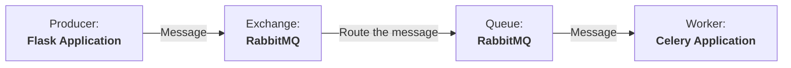

# E-mail Sender REST API
### Technologies
<section align="left">
    
    
    
    
    
    
    
    
    
    
    
    
    
    
</section>

#### Emails

| Method | URL                                          |     Description                |
| ------ | -------------------------------------------- | ------------------------------ |
| GET    | `/api/emails`                                | Get all emails                 |
| GET    | `/api/emails?status=<status>`                | Get all emails with status     |
| GET    | `/api/emails/<string:uuid_email>`            | Retrieve specific email        |
| POST   | `/api/emails/send`                           | Send email                     |
| POST   | `/api/emails/schedule`                       | Schedule email sending         |
| DELETE | `/api/emails/schedule/<string:uuid_schedule>`| Cancel scheduled email sending |

#### To start Celery with the Flower UI:
```bash
# Start the Celery App
celery -A src.app.celery_app:celery_app worker --loglevel=info
```
In another terminal, I also ran:
```bash
# Now, start the Flower UI
celery -A src.app.celery_app.celery_app flower
```
Consume the message and send the emailThis messaging architecture uses Flask as the application framework, RabbitMQ as the message broker, and Celery as the worker queue for processing asynchronous tasks like sending emails and schedules.
#### About messaging architecture


